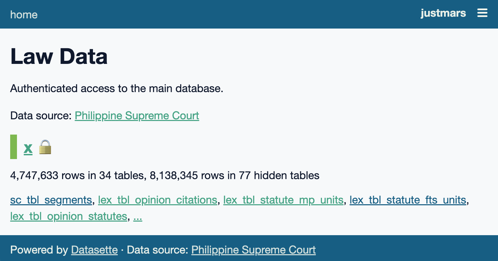
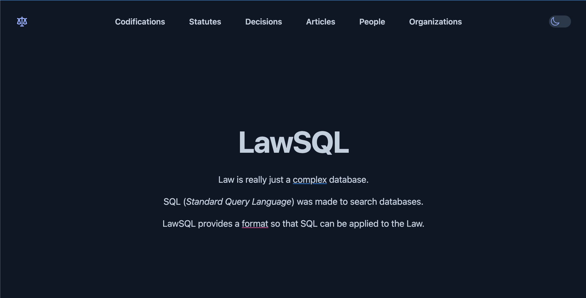

---
hide:
- navigation
---
# Projects

## `sqlpyd`

Use [sqlite-utils](https://sqlite-utils.datasette.io/) attributes in [pydantic](https://docs.pydantic.dev/) models:

```py
# TableConfig is a wrapper around `pydantic.BaseModel`
# `col`, `fts`, and `index` attributes utilize sqlite-utils functions
class RegularName(TableConfig):
    full_name: str | None = Field(None, col=str, fts=True, index=True)
    first_name: str = Field(..., max_length=50, col=str, fts=True)
    last_name: str = Field(..., max_length=50, col=str, fts=True, index=True)
    suffix: Suffix | None = Field(None, max_length=4, col=str)

    class Config:
        use_enum_values = True
```

[Documentation](https://justmars.github.io/sqlpyd){ .md-button }

## `citation-utils`

Extract citations of Philippine Supreme Court decisions from text.

```py
>>> text = """<em>Gatchalian Promotions Talent Pool, Inc. v. Atty. Naldoza</em>,
    374 Phil 1, 10-11 (1999), citing: <em>In re Almacen</em>,
    31 SCRA 562, 600 (1970).; People v. Umayam, G.R. No. 147033, April 30, 2003;
    <i>Bagong Alyansang Makabayan v. Zamora,</i> G.R. Nos. 138570, 138572,
    138587, 138680, 138698, October 10, 2000, 342 SCRA 449; Villegas <em>v.</em>
    Subido, G.R. No. 31711, Sept. 30, 1971, 41 SCRA 190;"""
>>> [c.dict(exclude_none=True) for c in Citation.extract_citations(text)]
[
    {'docket_category': 'GR', 'docket_serial': '147033', 'docket_date': datetime.date(2003, 4, 30), 'docket': 'GR 147033, Apr. 30, 2003'},
    {'docket_category': 'GR', 'docket_serial': '138570', 'docket_date': datetime.date(2000, 10, 10), 'docket': 'GR 138570, Oct. 10, 2000', 'scra': '342 SCRA 449'},
    {'docket_category': 'GR', 'docket_serial': '31711', 'docket_date': datetime.date(1971, 9, 30), 'docket': 'GR 31711, Sep. 30, 1971', 'scra': '41 SCRA 190'},
    {'scra': '31 SCRA 562'},
    {'phil': '374 Phil 1'}
]
```

[Documentation](https://justmars.github.io/citation-utils){ .md-button }

## `statute-trees`

Detect titles of Philippine statutes when found in text.

```py
# imagine messy legalese with citations
>>> text = """
A.M. No. 02-11-10-SC or the Rules on Declaration of Absolute;
Administrative Order No. 3 by enacting A.M. No. 99-10-05-0;
Parenthetically, under these statutes [referring to RA Nos. 965 and 2630]
Commonwealth Act (C.A.) No. 613, otherwise known as
the <em>Philippine Immigration Act of 1940</em>; see also
Republic Act No. 386
"""

>>> from statute_patterns import extract_rules
>>> list(extract_rules(text))
[Rule(cat='rule_am', id='02-11-10-sc'),
 Rule(cat='rule_am', id='99-10-05-0'),
 Rule(cat='ra', id='965'),
 Rule(cat='ra', id='2630'),
 Rule(cat='ca', id='613'),
 Rule(cat='ra', id='386')]
```

Create nested representations of Philippine statutes, codified statutes, and general legal documents.

```py
>>>r = Rule(cat='ra', id='386') # assign the Rule to `r`
>>>r(<path/to/statutes>) # get the base path to `/statutes`
StatuteDetails(
    created=1665225124.0644598,
    modified=1665225124.0644598,
    rule=Rule(cat='ra', id='386'),
    title='Republic Act No. 386',
    description='An Act to Ordain and Institute the Civil Code of the Philippines',
    id='ra-386-june-18-1949',
    emails=['maria@abcxyz.law', 'fernando@abcxyz.law'],
    date=datetime.date(1949, 6, 18),
    variant=1,
    units=[
        {
            'item': 'Container 1',
            'caption': 'Preliminary Title',
            'units': [
                {
                    'item': 'Chapter 1',
                    'caption': 'Effect and Application of Laws',
                    'units': [
                        {
                            'item': 'Article 1',
                            'content': 'This Act shall be known as the "Civil Code of the Philippines." (n)\n'
                        },
                        {
                            'item': 'Article 2',
                            'content': 'Laws shall take effect after fifteen days following the completion of their publication either in the Official Gazette or in a newspaper of general circulation in the Philippines, unless it is otherwise provided. (1a)\n'
                        },
                        ...
                    ]
                },
                ...
            ]
        },
        ...
    ],
    titles=[
        StatuteTitle(
            statute_id='ra-386-june-18-1949',
            category='alias',
            text='New Civil Code'
        ),
        StatuteTitle(
            statute_id='ra-386-june-18-1949',
            category='alias',
            text='Civil Code of 1950'
        ),
        StatuteTitle(
            statute_id='ra-386-june-18-1949',
            category='official',
            text='An Act to Ordain and Institute the Civil Code of the Philippines'
        ),
        StatuteTitle(
            statute_id='ra-386-june-18-1949',
            category='serial',
            text='Republic Act No. 386'
        )
    ]
)
```

[Documentation](https://justmars.github.io/statute-trees){ .md-button }

## `lawData`

_citation-utils_ and _statute-trees_ are principal ingredients of [corpus-x](https://github.com/justmars/corpus-x). The latter creates an [sqlite](https://sqlite.org) database, based on Philippine legal content, making it susceptible of being queried via _lawData_, a [Datasette](https://datasette.io) instance:



[Documentation](https://justmars.github.io/lawdata){ .md-button }

## `lawSQL`

Hosting _lawData_ content via third-party API calls, _lawSQL_ is the public-facing site made with [Django](https://djangoproject.com) and styled with [TailwindCSS](https://tailwindcss.com).



[Website](https://lawsql.com){ .md-button }
